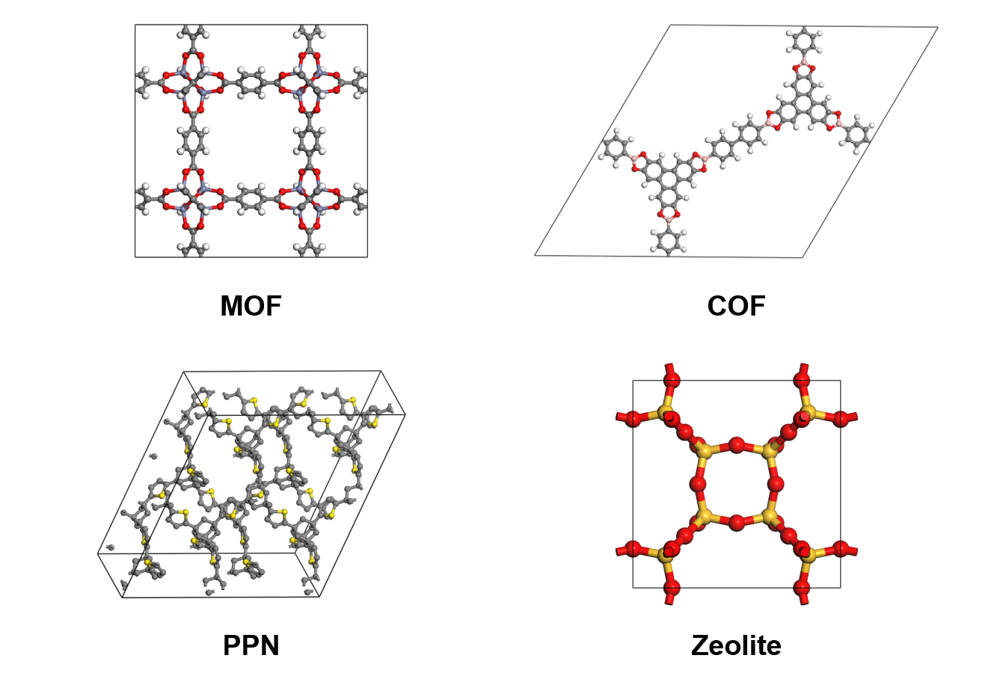

<div align="center">

<h1> 💻 Bulk Pormake Generation </h1>

  <p>
    <strong>Bulk generation of porous material with pormake</strong>
  </p>

</div>

<p align="center">
  
</p>

## 0. requirements
- python >= 3.8

## 1. Installation
```bash
# install pormake
$ pip install tqdm numpy pormake

# download bulk pormake generation
$ git clone https://github.com/Yeonghun1675/bulk_pormake_generation.git
```

## 2. Serialize pormake
```bash
# serialize pormake
$ python pormake_serialize.py

# Serialize pormake with cusom building blocks and topologies
$ python pormake_serialize.py --topo-dir=YOUR_TOPO_DIR 
```
- `topo-dir` is the directory of the topologies. If not specified, it uses pormake's default topology database. (default: `None`)


## 3. Generate pre-defined building block list
```bash
# make pre-defined building block list (MOF)
$ python rmsd_calculated_node.py --save=YOUR_SAVE_PATH

# make pre-defined building block list with custom bulding blocks and topologies
$ python rmsd_calculated_node.py --save=YOUR_SAVE_PATH --bb-dir=YOUR_BB_DIR --topo-dir=YOUR_TOPO_DIR
```
- `save` is the name of the file where the list of pre-defined building blocks will be saved. (default: `data/rmsd_calculated_node.pickle`)
- `bb-dir` is the directory of the building blocks. If not specified, it uses pormake's default building block database. (default: `None`)
- `topo-dir` is the directory of the topologies. If not specified, it uses pormake's default topology database. (default: `None`)


## 4. Make candidate list
```bash
# make candidate list
$ python make_candidates.py -n=NUMBER_OF_MATERIALS --pre-defined-list=YOUR_PRE_DEFINED_LIST --save=YOUR_SAVE_PATH

# make candidate list with custom building blocks and topologies
$ python make_candidates.py -n=NUMBER_OF_MATERIALS --pre-defined-list=YOUR_PRE_DEFINED_LIST --save=YOUR_SAVE_PATH --topo-dir=YOUR_TOPO_DIR --bb-dir=YOUR_BB_DIR --has-metal=HAS_METAL
```
- `pre_defined-list` is the name of the file where the list of pre-defined building blocks saved generated by [generate pre-defined building block list](#2-generate-pre-defined-building-block-list). (default: data/rmsd_calculated_node.pickle)
- `save` is the name of the file where the list of candidate will be saved (default: hmof_candidates.txt)
- `n` or `target_n_mofs` is number of materials
- `bb-dir` is the directory of the building blocks. If not specified, it uses pormake's default building block database. (default: `None`)
- `topo-dir` is the directory of the topologies. If not specified, it uses pormake's default topology database. (default: `None`)
- `has-metal` checks if the structure should contain metal. If True, structure must have metal atoms (for MOF). (default: `True`)


## 5. Build materials
```bash
# build materials
$ python build_materials.py --candidates=YOUR_CANDIDATE_LIST --save-dir=YOUR_SAVE_DIR

# build materials with custom building blocks and topologies
$ python build_materials.py --candidates=YOUR_CANDIDATE_LIST --save-dir=YOUR_SAVE_DIR --topo-dir=YOUR_TOPO_DIR --bb-dir=YOUR_BB_DIR 
```
- `candidates` or `candidate-list` is the list of candidates generated by [make candidate list](#3-make-candidate-list)
- `save-dir` is the directory where the cif files will be saved (default: `small/`)
- `large-dir` is the where materials above the cutoff are stored (default: `large/`)
- `cutoff` is the cutoff of cell length (default: `60.0`)
- `bb-dir` is the directory of the building blocks. If not specified, it uses pormake's default building block database. (default: `None`)
- `topo-dir` is the directory of the topologies. If not specified, it uses pormake's default topology database. (default: `None`)

## 6. Optimize materials using LAMMPS (optional)
```bash
$ cd optimize/

# generte lammps file using lammps intereface
$ python 0_make_lammps_interface.py

# make qsub file to calculate
$ python 1_make_optimize_qsub.py

# convert lammps-data file to cif file
$ python 2_convert_lammps_data.py
```


## Hypothetical porous materials database

- [MOF](https://figshare.com/ndownloader/files/38700612) (1 M)
- [COF](https://figshare.com/ndownloader/files/40299454) (0.5 M)
- [PPN](https://figshare.com/ndownloader/files/40299277) (0.3 M)
- [Zeolite](https://figshare.com/ndownloader/files/40299433) (0.1 M)


## Citation
If you want to cite bulk porous materials, please refer to the following paper:

1. Computational Screening of Trillions of Metal–Organic Frameworks for High-Performance Methane Storage, ACS Appl. Mater. Interfaces 2021, 13, 20, 23647–23654. [link](https://doi.org/10.1021/acsami.1c02471)

2. Enhancing Structure–Property Relationships in Porous Materials through Transfer Learning and Cross-Material Few-Shot Learning, ACS Appl. Mater. Interfaces 2023, 15, 48, 56375–56385. [link](https://doi.org/10.1021/acsami.3c10323)

## License 📄

This project is licensed under the MIT License. See the `LICENSE` file for more information.
